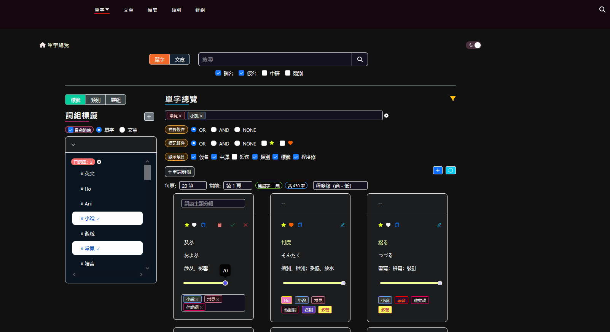
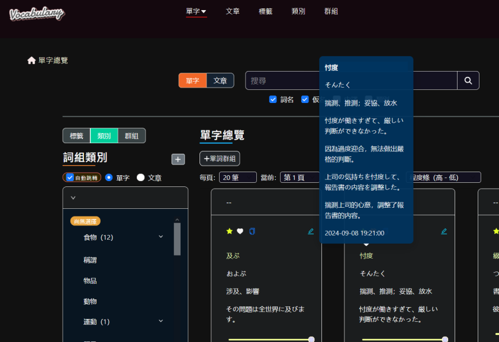
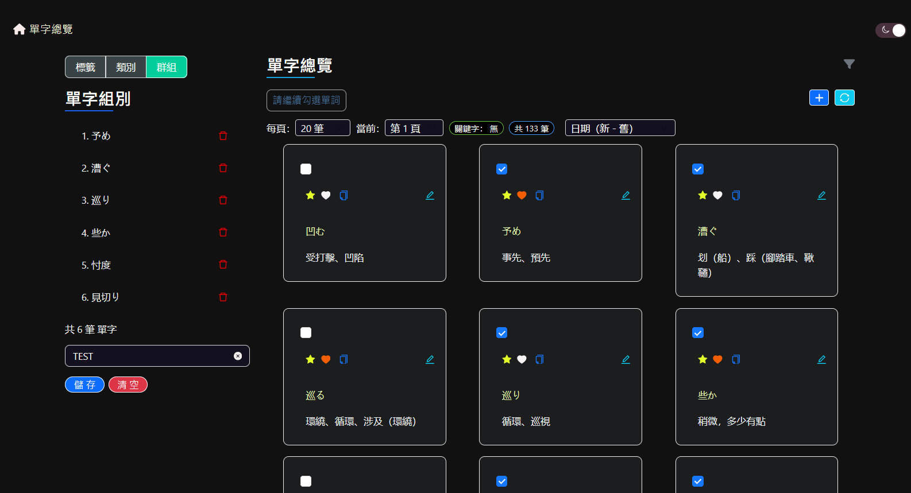

# vue-vocabulary

日文單字管理介面，透過標籤、類別、文章及群組管理，實現單字的多功能備忘錄。

搭配後端 API：[Laravel 版本（新）](https://github.com/tk50486yui/laravel-vocabulary.git)

----
### 開發目的

練習 Typescript 撰寫 Vue 3，並使用 Vite 和 Vuex 進行純前端開發，最後完成 Docker 環境部署。

順便寫一套方便自己學習日文的網站，以自身實際需求來精進整個系統的使用者操作體驗。

----
### 主要套件

``` 
    vue3
    vite
    vue-router 
    vuex
    typescript
    axios
``` 

----
### 目錄架構
```    
+ vue-vocabulary
    ├─ nginx              //  nginx.conf
    └─ src                //  主程式目錄
        ├─ api            //  宣告 API 與攔截器
        ├─ assets
        ├─ components     //  Vue Component
        ├─ interfaces     //  Interface
        ├─ libs           //  Library
        ├─ plugins
        ├─ repositories   //  API 接口
        ├─ router
        ├─ stores         //  Vuex
        │   └─modules     //  Vuex 資料儲存區
        ├─ views          //  Vue Component
        ├─ App.vue        //  Root Component
        └─ main.ts        //  主程式入口
```

----
### 版面元件

[Ant Design Vue](https://www.antdv.com/docs/vue/introduce) （v4.x）

[Element Plus](https://element-plus.org/en-US/)

----
### 版面樣式

基礎版型是使用 [Colorlib](https://colorlib.com/) 所提供的樣板，並進行響應式設計，整體呈現以網頁為主。

----
### 主題顏色

網站主要顏色為深色模式，可切換成明亮模式。主題顏色是透過 SCSS 來管理切換。

----
### Demo





